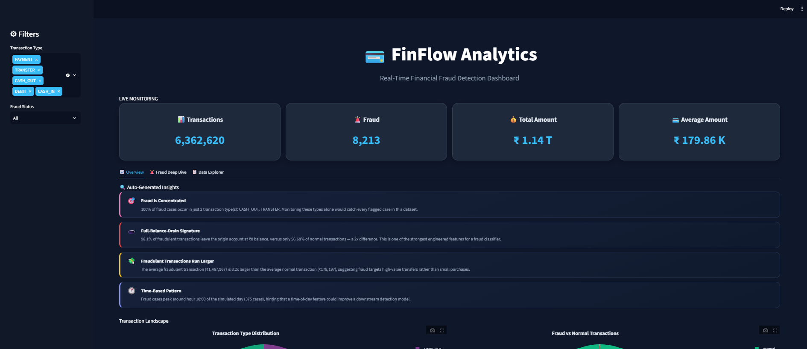
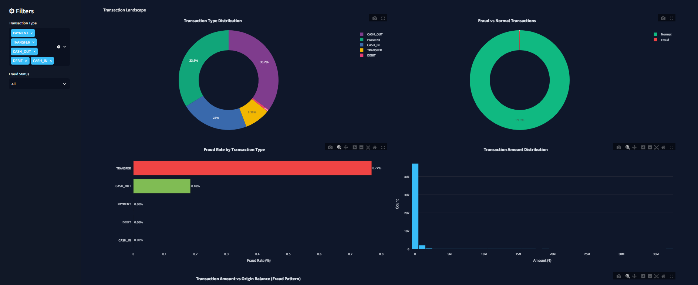
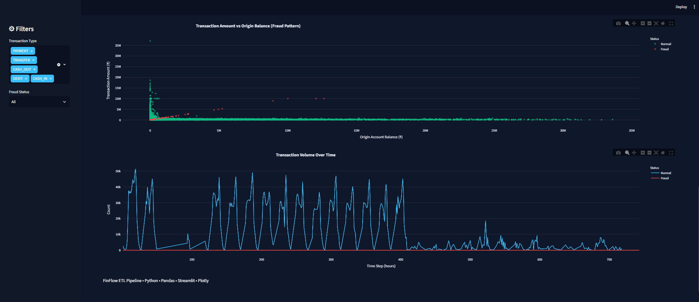
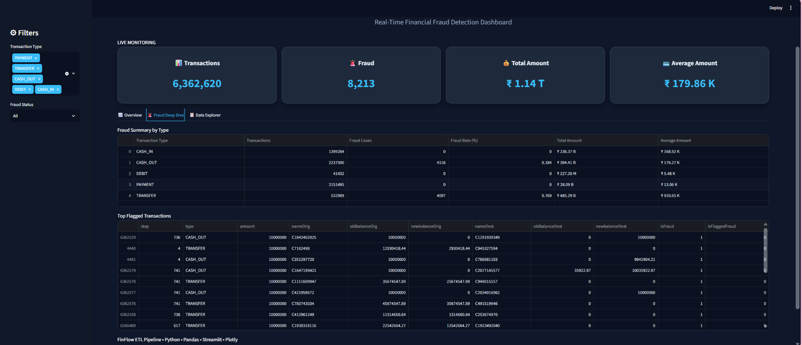
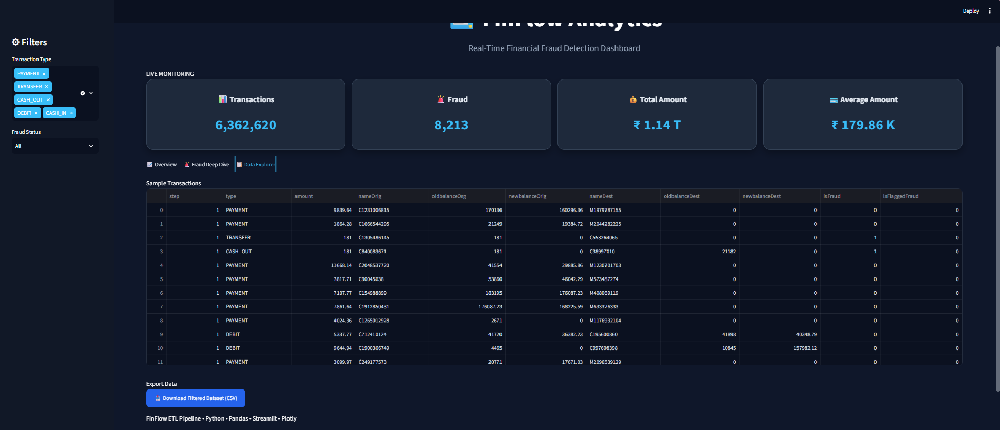

# 💳 FinFlow Analytics

> **An End-to-End Financial Data Engineering & Fraud Analytics Dashboard built with Python, PySpark, SQLite, Streamlit, and Plotly.**

FinFlow Analytics is a real-world financial data engineering project that demonstrates the complete ETL (Extract, Transform, Load) workflow on large-scale financial transaction data. The project processes millions of records, performs data validation and transformation, stores processed data in SQLite, and presents interactive fraud analytics through a modern Streamlit dashboard.

---

# 🚀 Features

- 📥 End-to-End ETL Pipeline
- 🧹 Data Cleaning & Validation
- ⚡ PySpark Data Processing
- 🗄️ SQLite Database Integration
- 📊 Interactive Streamlit Dashboard
- 📈 Live KPI Cards
- 📉 Transaction Analytics
- 🚨 Fraud Detection Dashboard
- 💡 Auto-Generated Insights
- 🎛️ Interactive Filters
- 📂 Data Explorer
- 📥 Export Filtered Data

---

# 🛠️ Tech Stack

| Category | Technologies |
|----------|--------------|
| Language | Python |
| Data Processing | Pandas, NumPy, PySpark |
| Database | SQLite |
| Dashboard | Streamlit |
| Visualization | Plotly |
| Version Control | Git & GitHub |

---

# 🏗️ ETL Workflow

```text
Raw Transaction Data
        │
        ▼
Extract Data
        │
        ▼
Data Cleaning
        │
        ▼
Validation
        │
        ▼
Transformation
        │
        ▼
PySpark Processing
        │
        ▼
SQLite Database
        │
        ▼
Interactive Dashboard
```

---

# 📂 Project Structure

```text
FinFlow-ETL-Financial-Data-Engineering-Pipeline
│
├── .streamlit/
│   └── config.toml
│
├── dashboard/
│   ├── app.py
│   ├── charts.py
│   ├── insights.py
│   ├── metrics.py
│   ├── sidebar.py
│   ├── styles.py
│   └── utils.py
│
├── screenshots/
│   ├── dashboard-overview.png
│   ├── transaction-landscape.png
│   ├── fraud-pattern-analysis.png
│   ├── fraud-deep-dive.png
│   └── data-explorer.png
│
├── scripts/
│   ├── database.py
│   ├── extract.py
│   ├── load.py
│   ├── spark_processing.py
│   ├── sqlite_db.py
│   ├── transform.py
│   └── validation.py
│
├── main.py
├── requirements.txt
├── test_connection.py
└── README.md
```

---

# 📸 Dashboard Preview

## 🏠 Dashboard Overview



---

## 📊 Transaction Landscape



---

## 🚨 Fraud Pattern Analysis



---

## 🔍 Fraud Deep Dive



---

## 📂 Data Explorer



---

# 📈 Dashboard Highlights

- Interactive KPI Cards
- Transaction Distribution Analysis
- Fraud Pattern Visualization
- Fraud Rate Monitoring
- Auto-Generated Insights
- Interactive Filtering
- CSV Export Functionality

---

# ⚙️ Installation

Clone the repository:

```bash
git clone https://github.com/ARCHITA-HUB27/finflow-etl-financial-data-engineering-pipeline.git
```

Navigate into the project:

```bash
cd finflow-etl-financial-data-engineering-pipeline
```

Install dependencies:

```bash
pip install -r requirements.txt
```

---

# ▶️ Run the Project

Launch the dashboard:

```bash
streamlit run dashboard/app.py
```

---

# 📁 Dataset

This project uses a simulated financial transaction dataset for fraud analysis.

> **Note:** The raw and processed datasets are not included in this repository because of their large size. Place the datasets inside:

```text
data/raw/
data/processed/
```

before running the ETL pipeline.

---

# 🚀 Future Improvements

- Machine Learning Fraud Prediction
- Real-Time Streaming with Kafka
- PostgreSQL Integration
- Docker Deployment
- Cloud Deployment (AWS/Azure)
- REST API Integration

---

# 👩‍💻 Author

**Archita Sen**

B.Tech Computer Science & Engineering  
Institute of Technical Education and Research (ITER), SOA University

📧 Email: architasen2@gmail.com

🌐 GitHub: https://github.com/ARCHITA-HUB27

---

## ⭐ If you found this project helpful, consider giving it a star!
